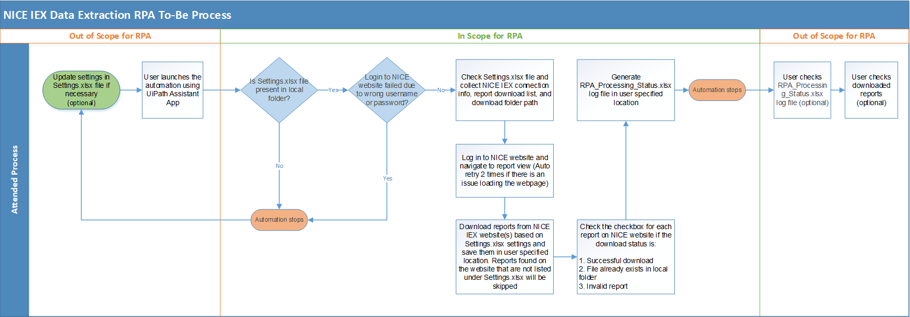

# NICE Workforce Engagement Management Report Download Automation
**Note: This project was developed for a client during my tenure at GDIT. As the code is not shareable, its purpose is to explain the project and demonstrate the process behind my solution.**

## Project Objectives
The manual process of downloading scheduled reports from the NICE website is exceedingly labor-intensive on a daily basis, taking roughly two hours per day for a user to download the reports manually.

This project aims to automate the download process of scheduled reports from the NICE website using APIs. It will save these reports to a user-specified location, mark the item checkbox on the website after each successful download, and generate an RPA processing log after each run.

## High Level As-Is Process

| Step     | Description 
| :---: | :--- |
| 1 | Log in to the NICE website  |
| 2 | Navigate to the Reports – View page  |
| 3 | Identify reports to download and manually click on each report to initiate the download  
| 4 | Select the destination to save the report and rename it. Repeat steps 3 and 4 until all reports are downloaded |
| 5 | Delete the downloaded reports from the report list on the NICE website  |

## To-Be Process

